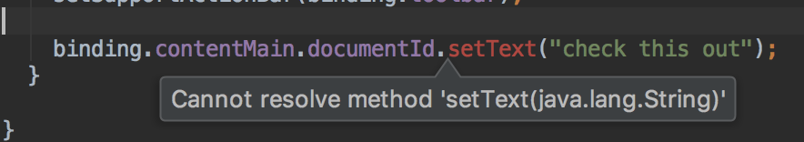

# DataBindingIncludeTest

This is a project documenting an [issue 68198305](https://issuetracker.google.com/68198305) which I raised for Android Studio 3.0.0-RC2.

## Short description

When using data binding and `<include>` (the bug was present in 3.0.0 preview, 3.0.0-RC1 and 3.0.0-RC2), Android Studio doesn't see generated methods. It gives an error (in that particular case) that "Cannot resolve method 'setText(java.lang.String)" despite the fact the project builds successfully and it's fully operational.    
The example app has 2 modules: **app** and **core-components**. The layout I want to include in the app is located in core-components module.   
**The bug occurs always when using <include> tag and 2 or more modules**. 

Layout hierarchy in the sample project is:

`activity_main.xml` includes `content_main.xml` layout and `content_main.xml` includes `document_text.xml` layout (which is in a different module --> **core-components**)

## Steps to reproduce

1. Open this project in Android Studio 3.0.0-RC2
2. Build it.
3. Go to `MainActivity` and check line 19: `binding.contentMain.documentId.setText("Check this out");`
